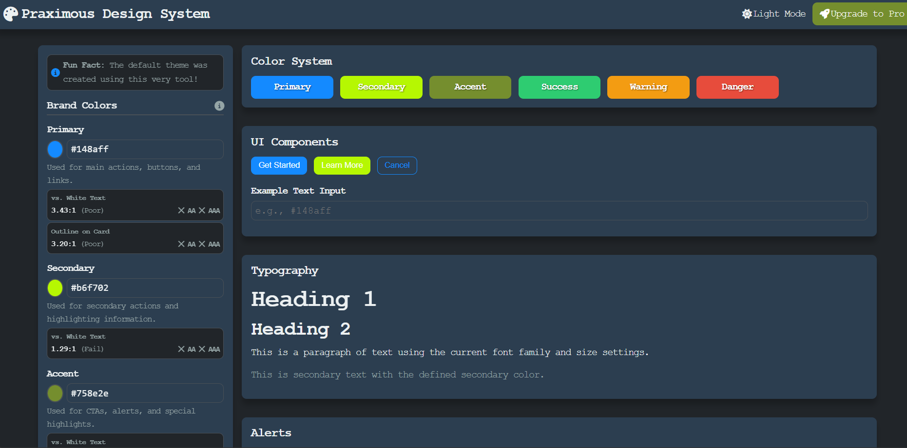

# Praximous Design System Generator


The Praximous Design System Generator is a powerful internal tool designed to create, manage, and export a consistent and brand-aligned CSS stylesheet. It provides a live, interactive interface to visually define design tokens (colors, fonts, spacing) and immediately see their effect on common UI components.

The final output is a production-ready `praximous-styles.css` file that can be imported into any project, ensuring brand uniformity and accelerating development.



> **Dogfooding in Action:** The current default theme you see when you open the generator was created entirely *with* the generator itself! We used the tool to define our new brand styles and then integrated the exported CSS back into the project as the new default.

---

## The Problem: The Challenge of Brand Consistency

As Praximous scales and develops more digital products, we face several critical challenges:

* **🎨 Brand Dilution:** Without a central style guide, projects can develop inconsistencies in colors, fonts, and spacing, leading to a fragmented and unprofessional user experience.
* **⏳ Wasted Developer Hours:** Developers spend valuable time writing boilerplate CSS, looking up hex codes, and "reinventing the wheel" for basic components in every new project.
* **🔧 High Maintenance Overhead:** A simple brand refresh (e.g., changing the primary color) becomes a monumental task, requiring developers to hunt down and edit multiple stylesheets across dozens of projects.
* **🚧 Designer-Developer Friction:** A gap often exists between a designer's vision and the final coded product. Manually translating design specs into CSS can lead to errors and misinterpretations.

## The Solution: A Single Source of Truth

This Design System Generator solves these problems by becoming the **single source of truth** for all front-end styling at Praximous.

* **✅ Enforces Uniformity:** By generating the *exact* same CSS variables and styles every time, it guarantees that every button, card, and layout across all our applications looks and feels like it's part of the same cohesive brand.
* **🚀 Accelerates Development:** Developers can skip the tedious CSS setup. They simply download the latest `praximous-styles.css` from this tool and can immediately start building features with pre-made, on-brand components.
* **⚙️ Centralizes Management:** Need to update the brand's border radius? Change it here once, click "Export," and the update is ready to be deployed across all projects. What used to take days now takes seconds.
* **🤝 Bridges the Gap:** The visual interface empowers designers and brand managers to make tangible styling decisions. They can perfect the brand's look and feel and export the production-ready code themselves, ensuring a perfect translation from vision to reality.

---

## Key Features

* **Live Visual Editing:** Modify brand colors, fonts, spacing, and more using an intuitive control panel.
* **Real-time Preview:** See your changes instantly reflected on a comprehensive set of sample UI components (buttons, forms, cards, etc.).
* **Dark/Light Theme Support:** A built-in theme toggle demonstrates and supports both light and dark mode styling. User preference is saved to local storage.
* **One-Click CSS Export:** Generate a clean, well-structured CSS file containing all your defined design tokens and theme settings.
* **Smart Tooltips:** Hover over info icons to get contextual best practices for CSS properties, making the tool a learning resource.
* **Self-Generated Theme:** The default theme is a real-world example created and exported using this very tool ("dogfooding").
* **Reset to Defaults:** Easily revert all changes back to the default Praximous brand settings.

---

## How to Use the Generator

This tool is designed to run locally with no complex setup.

1. **Clone or Download:** Get the project files (`index.html`, `style.css`, `app.js`, etc.) onto your local machine.
2. **Open in Browser:** Open the `index.html` file in any modern web browser (like Chrome, Firefox, or Edge).
3. **Define Your Style:** Use the interactive controls in the left sidebar to adjust colors, typography, spacing, and more.
4. **Export Your Tokens:** Once you're happy with the preview, click the **Export CSS** button. This will download a `praximous-styles.css` file containing all your settings as CSS variables.

## Using the Exported CSS

The `praximous-styles.css` file you export doesn't contain component styles (like `.card` or `.btn`). Instead, it provides a powerful set of **CSS Custom Properties (Variables)**, also known as design tokens.

This is by design. It gives you the flexibility to build your own components while ensuring they adhere to the brand's style guide.

Here’s the recommended workflow:

### 1. Link the Stylesheet

In your project's HTML, link to the `praximous-styles.css` file. This makes all the design tokens available globally.

```html
<!DOCTYPE html>
<html lang="en">
<head>
    <meta charset="UTF-8">
    <title>My Project</title>
    <link rel="stylesheet" href="path/to/praximous-styles.css">
    <link rel="stylesheet" href="my-components.css">
</head>
<body>
    <!-- Your content here -->
</body>
</html>
```

### 2. Create Your Component Styles

In your own stylesheet (e.g., `my-components.css`), define your components by referencing the variables from `praximous-styles.css`.

```css
/* my-components.css */
.btn {
    padding: var(--spacing-sm) var(--spacing-md);
    font-family: var(--font-family);
    color: white;
    background-color: var(--brand-primary);
    border: none;
    border-radius: var(--border-radius);
}
```

### 3. Use Your Components in HTML

Now you can use your consistently styled components throughout your project.

```html
<div class="card">
    <h2>Welcome!</h2>
    <p>This card and button are styled using the design tokens you created.</p>
    <button class="btn">Get Started</button>
</div>
```

This approach keeps your brand styles separate from your component logic, making your codebase clean, maintainable, and easy to update.

## Technology Stack

This project is intentionally built with a lightweight and accessible stack:

* **HTML5:** For the semantic structure of the application.
* **CSS3:** For all styling, leveraging **CSS Custom Properties (Variables)** for powerful and dynamic theming.
* **Vanilla JavaScript (ES6+):** For all interactivity, DOM manipulation, and the core logic of the generator. No frameworks or libraries are required.

---

## Future Roadmap

This MVP is a solid foundation. Our strategic plan includes enhancements for the core tool and a vision for a powerful "Pro" version.

### Immediate Enhancements

* [x] **Save/Load Theme Profiles:** Ability to save the current settings to a JSON file and load them back in later, allowing for multiple brand variations.
* [x] **Expanded Component Library:** Add more complex components like tables, modals, and navigation bars to the preview for more thorough testing.
* [x] **Advanced Style Controls:** Include controls for more nuanced properties like `box-shadow`, transition timings, and detailed font properties (e.g., `letter-spacing`).
* [x] **Accessibility Checker:** Integrate a tool to evaluate color contrast and ensure accessibility compliance.
* [x] **Export Options:** Allow exporting in different formats (e.g., SCSS, LESS) or as a CSS-in-JS object for modern frameworks.
* [x] **Best Practice Tooltips:** Integrated contextual help that provides best practices for CSS properties on hover.
* [x] **Documentation Generator:** Automatically create a self-contained style guide HTML document based on the current theme settings.

### Pro Version Vision: "CSS-as-a-Service"

* [ ] **Live-Hosted Stylesheets:** The Pro tier will move from a file-export model to a dynamic service. Instead of downloading a `style.css` file, users will get a unique, permanent URL to a stylesheet hosted on a CDN.
* [ ] **"Publish" Instead of "Export":** The generator will feature a "Publish" button that securely updates the live stylesheet on our server.
* [ ] **Zero-Effort Updates:** Projects will simply link to their unique URL with a single `<link>` tag. Any style changes published in the generator will be reflected on all live websites instantly, with no need to replace files or redeploy code. This is the ultimate solution for effortless brand consistency.
* [ ] **Versioning and Rollbacks:** Each published stylesheet will have version control, allowing users to revert to previous styles if needed.
* [ ] **User Authentication:** Implement user accounts to save themes in the cloud. *Local save/load is already implemented for free users.*
* [ ] **User Accounts and Collaboration:** Enable multiple users to collaborate on style definitions, with role-based access control.
* [ ] **Analytics Dashboard:** Provide insights into how often styles are updated and which components are most used.
* [ ] **Integration with Design Tools:** Explore plugins for popular design software (Figma, Sketch) to sync design tokens directly.
* [ ] **Theming API:** Offer an API for developers to programmatically update styles or fetch the latest design tokens.
* [ ] **Custom Branding:** Allow agencies or enterprises to white-label the generator for their own clients.

---

## Contributing

Contributions are welcome! Please fork the repository and submit a pull request with your improvements. For major changes, please open an issue first to discuss what you would like to change.

## License

This project is licensed under the MIT License. See the [LICENSE](LICENSE) file for details.

## Contact

For questions or support, please contact the Praximous development team at [support@praximous.com](mailto:support@praximous.com).

---
